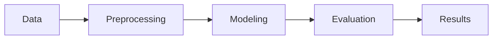

# baf-ml

Machine Learning Modeling for Task #1 of Knowledge Discovery on Databases Course on MAPi.

## Steps of the project

```mermaid
graph LR
    A[Data] --> B[Preprocessing]
    B --> C[Modeling]
    C --> D[Evaluation]
    D --> E[Results]
```